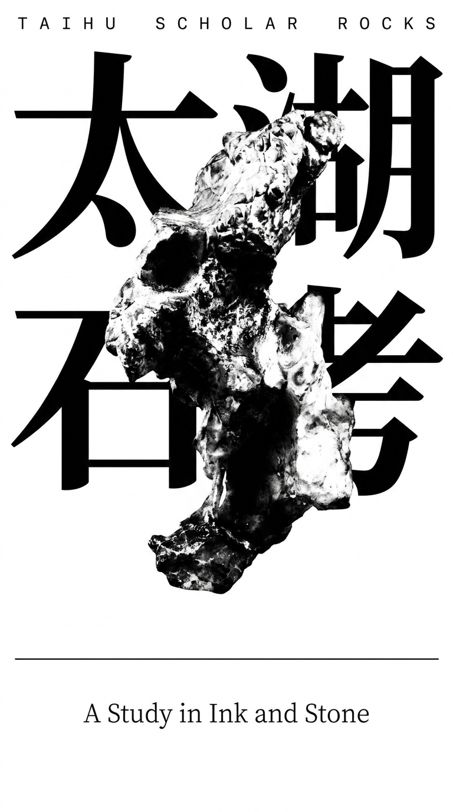
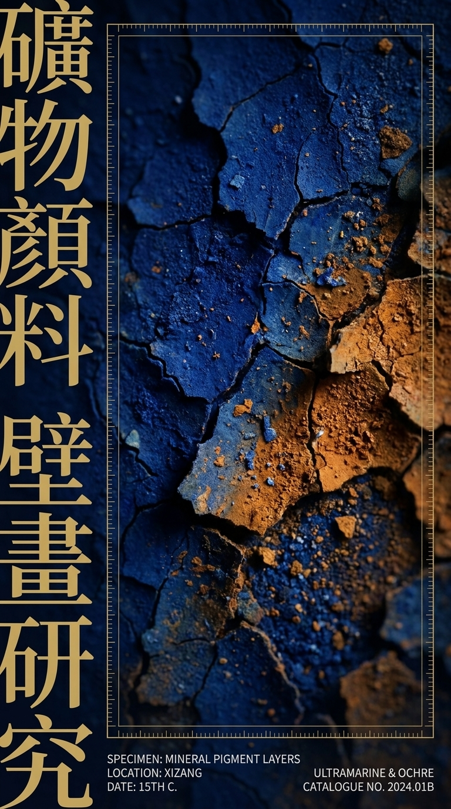

# 🎨 Culture Fragment Poster Engine

> 把文化碎片变成高级视觉 —— 一个专注于文化素材海报化的 AI Skill

<p align="center">
  
  
</p>

---

## 这是什么

**Culture Fragment Poster Engine** 是一个为 AI 编程助手（Codex / Claude Code / MiniMax Code 等）设计的 Skill。

它解决的核心痛点是：

> 手里有一堆文化素材（非遗纹样、传统建筑、工艺细节、地域视觉元素……），怎么**快速**转化成高端商业海报方向？

很多人拿到文化素材后，要么直接贴上去变成了旅游纪念品风格，要么不知道怎么把传统元素变得现代、高级。这个 Skill 就是来解决这个问题的。

## 工作原理

它不是简单地拼贴文化图片，而是构建一条完整的**视觉翻译链**：

```
导入素材 → 建立索引 → 分类标签 → 识别文化事实 → 筛选再诠释方法
→ 隔离敏感元素 → 萃取视觉基因 → 路由任务类型 → 生成海报方向/Prompt
→ 溯源验证 → 排版校正
```

每一步都有严格的规则：

- **文化事实 vs 商业再诠释** — 自动区分，商业案例只学方法，不当文化证据
- **敏感元素隔离** — 经文、宗教图像、祭祀器物等自动标记，不会被随意用在商业海报里
- **视觉基因萃取** — 从素材中提取色彩、肌理、构图、版式节奏等可复用的设计语言
- **排版校正** — AI 生图的中文/藏文不准确？自动标注哪些需要后期重排

## 能做什么

### 📁 素材管理
把文化图片文件夹变成有体系的视觉资产索引。每张图片都会被标记 `source_type`、`visual_role`、`risk_level`、`weight` 等分类字段，30+ 张图片还会输出核心资产、敏感资产、关系表。

### 🖼️ 海报 / KV 概念生成
从传统素材直接生成高端海报视觉方向。支持的类型包括：
- 摄影主导主视觉
- 编辑式拼贴
- 上图下文
- 传统艺术再编辑化
- 先锋实验
- 物件解构
- 极简奢华
- 奢侈品品牌 Campaign
- 字体艺术书封面
- 标本/研究系统海报
- 时尚/编辑式材质 Campaign

### 💎 品牌视觉转化
专门针对高端商业需求优化：
- 刺绣 → 发光线系统、针迹密度、地形线
- 戏曲 → 水袖运动、姿态韵律、舞台光影
- 木版画 → 墨韵肌理、色彩错版、刻痕边缘
- 织锦/缂丝 → 经纬结构、金线闪光、面料褶皱
- 园林/太湖石 → 虚空、框景、尺度、多孔剪影、负空间

### ✍️ AI 生图 Prompt
输出可直接用于图像生成的高质量提示词，控制在 1200 字符以内，80-160 个英文单词。不会把分析表格、溯源笔记、任务识别这些东西塞进 Prompt。

### 🚫 审美把关
自动规避：
- 旅游纪念品风格
- 整页传统花纹边框
- 五色平均分布
- 宗教器物直接商品化
- 通用居中标题排版

<p align="center">
  
  <br/>
  <em>示例：藏地壁画矿物颜料素材 → 奢侈品文化Campaign视觉方向</em>
</p>

## 安装

将 `culture-fragment-poster-engine` 文件夹放到你的 Skill 目录：

```bash
# Codex
~/.codex/skills/culture-fragment-poster-engine

# MiniMax Code (Mavis)
~/.mavis/skills/culture-fragment-poster-engine
```

目录结构：

```
culture-fragment-poster-engine/
├── SKILL.md                    # 技能主文件（216 行核心规则）
├── agents/
│   └── openai.yaml             # Agent 配置
└── references/
    └── full-rules.md           # 完整规则文档（938 行详细规范）
```

## 使用方法

在对话中提到 Skill 名称即可触发。不需要手动选择方案，系统会自动路由到最匹配的方向。

### 基础用法

```
$culture-fragment-poster-engine 帮我把这组非遗纹样和建筑照片整理成高级品牌海报方向。
```

### 指定风格

```
$culture-fragment-poster-engine 根据这些图片做一张高端展览主视觉，不要旅游纪念品风格，要更像艺术书封面。
```

### 版式迁移

```
$culture-fragment-poster-engine 我喜欢这个版式，但内容换成苏州园林、太湖石和当代香水广告，请重新设计视觉方向。
```

### 品牌 KV

```
$culture-fragment-poster-engine 用这组藏地素材做一个高端香水品牌 KV，要有诗意和克制感。
```

## 核心原则

| 原则 | 说明 |
|------|------|
| 🔍 **文化可溯** | 每个视觉决策都能追溯到具体的文化来源 |
| ⚖️ **事实与再诠释分离** | 商业案例可以学方法，但不能当文化证据 |
| 🛡️ **敏感元素隔离** | 经文、完整宗教图像、祭祀器物等自动标记和隔离 |
| 🔄 **翻译而非复制** | 视觉基因转化为当代图形语言，而不是直接挪用 |
| 🔤 **字体即资产** | 排版是构图的核心元素，不是装饰 |
| 🎯 **克制审美** | 控制色彩、强裁切、不对称、留白、清晰层级 |

## 支持的任务类型

| 类型 | 触发场景 | 输出 |
|------|----------|------|
| 📦 大批量素材导入 | 文件夹或 10+ 张图片 | 资产索引 + 分类表 + 核心资产筛选 |
| 🖼️ 单张海报 | 海报、KV、广告、封面 | 视觉方向 + 生图 Prompt + 溯源 |
| 💎 高端品牌 KV | 奢侈品、时尚、香水、美妆 | 品牌级视觉方向 + 排版方案 |
| 🔄 版式迁移 | 喜欢某个版式，用不同素材重做 | 提取版式基因 + 重新构图 |
| 🔀 变体请求 | 要另一个方向 / 完全不同版本 | 新方向 + 对比说明 |
| ✨ 文化精修 | 加藏文、调文化感、提升高级感 | 精修方案 + 排版校正 |

## 输出格式

### 单张海报任务输出

1. 任务识别
2. 选定素材
3. 视觉基因
4. 一句话视觉定位
5. 生图 Prompt
6. 来源溯源
7. 排版校正说明

### 大批量素材输出

1. 素材概览
2. 图片关系表
3. 核心资产
4. 再诠释/版式参考
5. 敏感及排除资产
6. 标签表

## License

MIT
